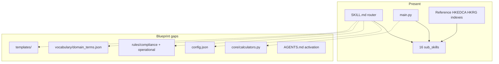
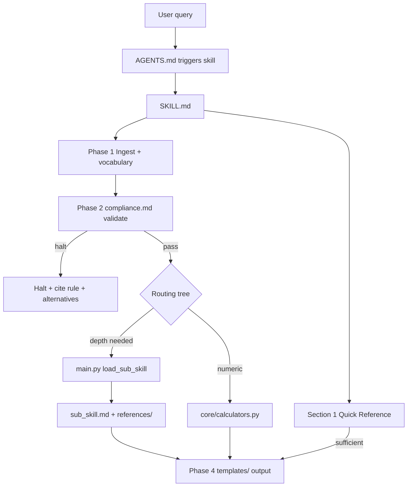

# Claude Desktop vs Blueprint — Improvement Review

## Current state summary

[`Claude Desktop/`](Claude Desktop/) is a **Tier 2 professional suite** with:

| Component | Status |
|-----------|--------|
| Master router [`SKILL.md`](Claude Desktop/SKILL.md) | Present (~305 lines — within 500-line target) |
| Sub-skills | **16 modules** (not 35+ as stated in Blueprint appendix) |
| `main.py` dispatcher | Present — `load_sub_skill` + `run_interior_calculator` |
| `config.json`, `rules/`, `vocabulary/`, `templates/`, `core/` | **Missing** |
| HKEDCA + HKRG integration | Strong in 3 primary + 7 trade sub-skills |
| Project activation (`AGENTS.md` / `.cursor/rules/`) | **Missing** |



---

## Strengths (already aligned with Blueprint)

1. **Correct tier choice** — Multi-domain interior practice with explicit sub-skill routing fits Tier 2.
2. **Trigger-rich description** — Master frontmatter is third-person, WHAT + WHEN, ~770 chars (under 1024 limit).
3. **Progressive disclosure** — Quick reference in Section 1; depth in sub-skills and `references/`.
4. **Routing decision tree** — Text tree plus HK-specific branches (HKEDCA/HKRG) is more detailed than the blueprint table alone.
5. **Reference tables in sub-skills** — Every sub-skill has at least one auditable table (blueprint §3.3 schema rule).
6. **HK dual-source pattern** — Index → `references/hkedca-*.md` / `hkrg-*.md` → sub-skill → master router is well executed for site/handover/tendering.
7. **Custom extensions beyond blueprint** — `Region-Switch Notes` and `Auto-Chain Directives` on all 16 sub-skills add deterministic cross-routing.

---

## Gap analysis by Blueprint section

### 1. Frontmatter and activation (§3, §8)

| Gap | Detail | Blueprint fix |
|-----|--------|---------------|
| Missing `disable-model-invocation` | Master [`SKILL.md`](Claude Desktop/SKILL.md) has only `name` + `description` | Add `disable-model-invocation: true` unless ambient auto-load is intended |
| Non-standard install path | Skill lives in `Claude Desktop/` not `.cursor/skills/interior-designer-master/` | Mirror or symlink to project skill path; wire activation in `AGENTS.md` |
| No activation rule | No `AGENTS.md` or `.cursor/rules/` entry | Add: "When interior design / HK renovation → read `Claude Desktop/SKILL.md`" |
| No golden-question verification | No documented test prompts | Add 3 verification prompts from Blueprint §8C |

### 2. Tier 2 infrastructure (§4, §6)

**Entire canonical folders absent:**

```
Claude Desktop/
├── config.json              ← missing
├── rules/
│   ├── compliance.md        ← missing
│   └── operational.md       ← missing
├── vocabulary/
│   └── domain_terms.json    ← missing
├── templates/               ← missing
└── core/
    └── calculators.py       ← missing (main.py imports it)
```

Impact:
- No `strict_mode`, `allow_assumptions`, or `enforce_jurisdictional_bounds` flags
- Halt/licensing boundaries are scattered in sub-skill decision rules, not centralized
- 30+ acronyms (AHJ, STC, NRC, RT60, UGR, BOQ, DLP, SI, VE, etc.) are undefined in a single vocabulary file
- No output boilerplate for SI, snag log, tender QA memo, handover checklist

**Recommended `config.json` fields for this domain:**

```json
{
  "skill_metadata": { "name": "interior-designer-master", "version": "1.0.0", "strict_mode": true },
  "operational_boundaries": {
    "allow_assumptions": false,
    "default_jurisdiction": "global_with_hk_mode",
    "maximum_iteration_depth": 3
  },
  "compliance_verification": {
    "require_framework_citations": true,
    "enforce_jurisdictional_bounds": true,
    "target_governance_framework": "IBC/NFPA/ADA + HK BD/FSD/EMSD + HKEDCA/HKRG industry practice"
  }
}
```

### 3. Master SKILL.md structure (§5)

Master file has strong Sections 1–4 but omits blueprint orchestrator sections:

| Missing section | Why it matters |
|-----------------|----------------|
| **Identity and Core Mission** (persona, objective, 3–5 expertise areas) | Sets non-negotiable role boundary vs generic chat |
| **Operational Environment** (jurisdiction, stakeholders, tools) | HK vs global mode needs explicit stakeholder list (owner, 判頭, designer, AHJ) |
| **4-phase Cognitive Workflow** (Ingest → Validate → Analyze → Synthesize) | Phase 2 should invoke `rules/compliance.md` with **hard stop** on violation |
| **Tabular sub-skill routing** | Decision tree exists but blueprint table aids quick lookup |
| **Universal response constraints** | "Start with deliverable, no preamble" not stated at master level |
| **Explicit halt conditions** | e.g. licensed sign-off, gas works without registered contractor, scaffold without engineer design |

Add a **Quantitative thresholds** table (Blueprint §6) — examples already implicit in Section 1 but not sourced:

| Metric | Threshold | Source |
|--------|-----------|--------|
| Floor level delta at transition | Flag if > 3 mm | SKILL §1.4 |
| Office RT60 | 0.5–0.8 s | SKILL §1.7 |
| Meeting partition STC/Rw | 45+ | SKILL §1.7 |
| HK scaffold harness anchor | ≥ 6 kN | fire-life-safety ref |
| Materiality / variance (tender) | 5% BOQ line | operational rule (to add) |

### 4. Sub-skill template compliance (§4)

All 16 sub-skills deviate from the blueprint sub-skill template:

| Requirement | Current state |
|-------------|---------------|
| YAML frontmatter (`name`, `description`) | **None** — all start with `# interior-*` heading only |
| "For X, use `<other-id>` instead" at top | **None** — only informal cross-refs in Decision Rules |
| "When to Use \| Use instead" table | **None** |
| `load_sub_skill` discoverability | Descriptions not in frontmatter → harder auto-routing |

Example target for [`interior-fire-life-safety.md`](Claude Desktop/sub_skills/interior-fire-life-safety/interior-fire-life-safety.md):

```yaml
---
name: interior-fire-life-safety
description: >
  Egress, compartmentation, sprinkler/detector coordination, and HK scaffold/WAH.
  Use for fire strategy, travel distance, exit width, or 搭棚 safety.
---
```

Plus routing table: statutory submissions → `interior-statutory-compliance`; ceiling clashes → `interior-mep-clash-detection`.

### 5. Python dispatcher and calculators (§4, §7)

[`main.py`](Claude Desktop/main.py) is structurally correct but incomplete:

- **`core/calculators.py` does not exist** — `EgressCalculator` import fails silently; only egress path attempts real math
- **`run_interior_calculator` stubs** — `occupancy_load`, `thickness_buildup`, `lux_targeting` return `"logic ready"` placeholders
- **No LaTeX formulas** in master or sub-skills for quantitative outputs (Blueprint §7)
- **`__pycache__/main.cpython-311.pyc`** should not be tracked

Recommended formulas to implement or document in markdown:

- Egress capacity / occupant load
- Build-up stack: `$T_{total} = \sum t_i$` with transition flag when adjacent finishes differ > 3 mm
- Lux targeting with maintenance factor

### 6. Templates and deliverables (§3, §5 Phase 4)

No [`templates/`](Claude Desktop/) folder. High-value templates for this suite:

| Template | Sub-skill owner |
|----------|-----------------|
| Site Instruction (SI) draft | `interior-site-supervision` |
| Snag / defect log | `interior-handover-dlp` |
| Tender completeness audit | `interior-tendering-qa` |
| Good-Better-Best VE comparison | `interior-value-engineering` |
| Compliance gap memo | `interior-statutory-compliance` |
| HKRG adoption boilerplate (already in §1.11) | promote to template file |

### 7. Vocabulary (§2, §6, Quality Checklist)

Create [`vocabulary/domain_terms.json`](Claude Desktop/vocabulary/domain_terms.json) with ~25–40 terms, e.g.:

- AHJ, LOD, RCP, FF&E, STC/Rw, NRC, RT60, UGR, CCT/CRI
- HK: 清拆, 坭水, 交收, 執漏, 掛牌, BOQ, DLP, 判頭
- Process: SI, VO, SD/DD/CD, as-built

Master Phase 1 should say: "Cross-reference `./vocabulary/domain_terms.json` before proceeding."

### 8. Compliance and halt rules (§6, §9)

Centralize in [`rules/compliance.md`](Claude Desktop/rules/compliance.md):

**Universal halts (interior-specific):**
- Do not authorize work that breaches egress/fire/accessibility without AHJ path
- Gas hob removal/install — registered gas contractor only (HKEDCA)
- Scaffold — engineer design + inspection cadence; stop on typhoon signals
- HKRG/HKEDCA quotes — industry practice only; legal review before issue
- Do not invent code clauses or HKEDCA/HKRG section citations

**Licensing boundary:** Advisory support only — not licensed architect/engineer sign-off, not statutory submission authority.

[`rules/operational.md`](Claude Desktop/rules/operational.md) should document:
- Scale defaults (1:50 layout, 1:5 joinery)
- Clash hierarchy (FS > P&D > HVAC > ELV > aesthetic)
- HK trade sequence gates from §1.10
- Artifact naming (SI-###, SNAG-###, RFI-###)
- Dual-source citation rule when HKEDCA and HKRG conflict

### 9. Reference depth and consistency

| Issue | Detail |
|-------|--------|
| **Uneven HK enrichment** | Primary 3 sub-skills ~95–104 lines; generic modules ~35 lines |
| **Reference path hops** | Canonical indexes live in [`Reference/`](Reference/) outside suite — acceptable if master links once, but sub-skills use `../../../Reference/` (multi-hop) |
| **Duplicate tables** | e.g. acoustic has both "Typical Acoustic Targets" and "Typology Acoustic Targets" with overlap |
| **Blueprint appendix inaccuracy** | Blueprint §11 claims "35+ sub_skills" — update to 16 or expand suite |

### 10. Role Intake Worksheet (§2)

No persisted intake artifact in repo. Recommend adding [`Claude Desktop/ROLE-INTAKE.md`](Claude Desktop/ROLE-INTAKE.md) capturing:

- Role: Full-service interior designer (global + HK residential renovation)
- Jurisdiction: Global defaults + HK mode (BD/FSD/EMSD/WSD/LD + estate rules)
- Halt conditions: (listed above)
- Stakeholders: Owner, contractor, designer, AHJ, estate management
- Deliverables: Plans, schedules, SI, tender packages, handover docs

---

## Prioritized improvement backlog

### P0 — Compliance and correctness (do first)

1. Add `rules/compliance.md` + `config.json` with halt conditions and licensing boundaries
2. Add `disable-model-invocation: true` to master frontmatter
3. Implement or remove `core/calculators.py` — either ship egress/occupancy/build-up/lux math or drop stub tool from SKILL.md
4. Add YAML frontmatter to all 16 sub-skills
5. Wire skill activation via `AGENTS.md` (or `.cursor/rules/`)

### P1 — Routing quality and outputs

6. Add "When to Use \| Use instead" table to each sub-skill
7. Restructure master SKILL.md with Identity, Operational Environment, 4-phase workflow, universal response constraints
8. Create `vocabulary/domain_terms.json`
9. Add `templates/` for SI, snag log, tender audit, VE comparison
10. Add `rules/operational.md` (SOPs, escalation, HK trade gates)

### P2 — Depth, verification, hygiene

11. Document golden verification prompts (routine / deep route / compliance halt)
12. Normalize HK reference depth across remaining thin sub-skills (lighting, procurement, brand graphics)
13. Consolidate duplicate reference tables; keep one-hop ref links from master
14. Fix Blueprint appendix "35+ sub_skills" → 16
15. Add `.gitignore` for `__pycache__/`
16. Optional: mirror skill to `.cursor/skills/interior-designer-master/` for Cursor-native discovery

---

## Quality checklist scorecard (Blueprint §9)

| Criterion | Pass? | Notes |
|-----------|-------|-------|
| Constraints explicit / measurable | Partial | Numbers exist in quick ref but no sourced threshold table |
| Description has triggers | Yes | |
| Vocabulary populated | No | |
| Halt criteria documented | Partial | Scattered, not centralized |
| Master under ~500 lines | Yes | 305 lines |
| Sub-skills cross-link "use instead" | No | Auto-Chain only |
| No AI fluff | Partial | Not enforced at master level |
| Assumptions declared | Partial | AHJ-dependent notes only |
| Formulas justified | No | Calculator stubs |
| Plan Mode verified | No | No golden questions on file |

**Estimated compliance: ~5/10 checklist items fully met.**

---

## Suggested target architecture (after improvements)



---

## Files to touch (implementation phase)

| File | Action |
|------|--------|
| [`Claude Desktop/SKILL.md`](Claude Desktop/SKILL.md) | Add frontmatter field, identity/workflow sections, compliance hooks |
| [`Claude Desktop/config.json`](Claude Desktop/config.json) | Create |
| [`Claude Desktop/rules/compliance.md`](Claude Desktop/rules/compliance.md) | Create |
| [`Claude Desktop/rules/operational.md`](Claude Desktop/rules/operational.md) | Create |
| [`Claude Desktop/vocabulary/domain_terms.json`](Claude Desktop/vocabulary/domain_terms.json) | Create |
| [`Claude Desktop/templates/*.md`](Claude Desktop/templates/) | Create 4–5 deliverable templates |
| [`Claude Desktop/core/calculators.py`](Claude Desktop/core/calculators.py) | Create or remove tool references |
| All 16 `sub_skills/*/*.md` | Add frontmatter + routing tables |
| [`AGENTS.md`](AGENTS.md) | Create — skill activation |
| [`Blueprint & Toolkit- Creating High-Performance Claude Professional Skills.md`](Blueprint & Toolkit- Creating High-Performance Claude Professional Skills.md) | Fix appendix sub-skill count |

No code changes are included in this review — this is the improvement inventory only.
